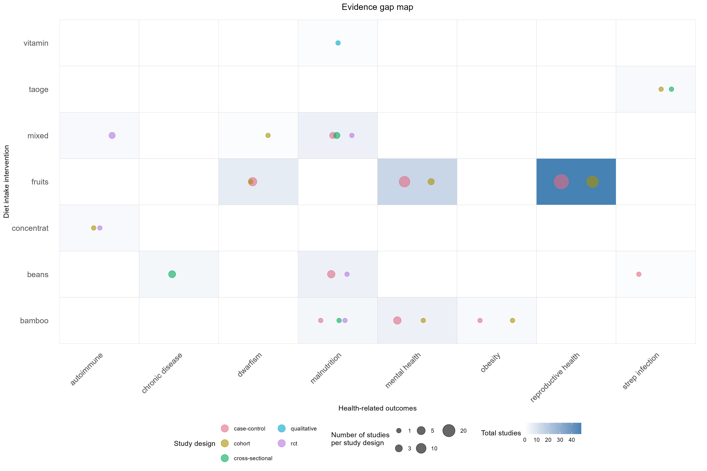

# Evidence gap map
Creating an evidence gap map to visualize your literature review.

<i>Note: This example of the evidence gap map is using dummy data.</i>

## PICO questions
  Population = adult panda  
  Intervention = any diet type  
  Comparator = any diet type  
  Outcomes = health-related outcomes  

## Evidence gap map
<figure>

</figure>
